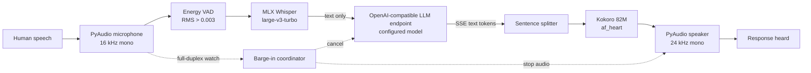

# Human voice turn: command to heard response

This document follows the exact production path exercised on August 26, 2026:

```bash
.venv/bin/geno-voice agent full-duplex
```

It explains which code runs from process startup through the first sound heard
from the assistant, what remains local, what is sent to the configured LLM
endpoint, and why the live test interrupted its own responses.

The traced checkout was `prototype-wav-agent` at commit `9a0a844`. The reusable
agent entrypoint was introduced on `agent-duplex-cli` at `d443859`.

## The short version

This is a cascaded voice system, not a single speech-to-speech model:



Audio never goes to the configured LLM endpoint. Whisper turns the microphone
recording into text on the Mac. The endpoint receives the system prompt and
textual conversation. Kokoro turns the response text back into audio locally.

## Runtime configuration used in the test

This provider-neutral example selects an OpenAI-compatible endpoint, MLX
Whisper, and a calibrated VAD threshold:

```yaml
llm:
  model: your-model-name
  base_url: https://llm.example.com/v1
  api_key: ${LLM_API_KEY}
  max_tokens: 150

chat:
  stt_engine: whisper
  stt_model: mlx-community/whisper-large-v3-turbo
  vad:
    silence_threshold: 0.003
    silence_duration: 0.8
    min_speech_duration: 0.3
```

The API key is resolved from the environment at runtime. It is not embedded in
the source or this document.

At test time the Zone device was not connected. macOS reported:

- Input: `MacBook Pro Microphone`
- Output: `DELL U4323QE`

That detail matters because the full-duplex failure was acoustic speaker
leakage into the MacBook microphone. The Zone hardware's noise suppression was
not active during this trace.

## Startup: what the command triggers

### 1. Console entrypoint

`pyproject.toml` installs both `geno-voice` and `gv` as the same Python
entrypoint:

```toml
[project.scripts]
geno-voice = "geno_voice.cli:main"
gv = "geno_voice.cli:main"
```

[`geno_voice/cli.py`](../geno_voice/cli.py) then delegates to the mature command
parser in `examples.gv`:

```python
def main(argv=None) -> int:
    from examples.gv import main as gv_main
    return gv_main(argv, prog="geno-voice")
```

### 2. `agent full-duplex` becomes an `AgentConfig`

[`examples/gv.py`](../examples/gv.py) parses the mode and constructs the public
configuration object:

```python
run_agent(
    AgentConfig(
        mode=AgentMode(args.agent_mode),
        stt_model=args.model,
        voice=args.voice,
        speed=args.speed,
    )
)
```

[`geno_voice/agent.py`](../geno_voice/agent.py) translates the friendly mode
name into concrete behavior:

```python
if resolved is AgentMode.FULL_DUPLEX:
    return AgentModeConfig(full_duplex=True, barge_in_enabled=True)
return AgentModeConfig(full_duplex=False, barge_in_enabled=False)
```

It then calls `examples.mic_chat.run_chat(...)`. This is the seam OpenCode can
reuse later: the desktop app can import `run_agent()` and inject `llm_config`
and `chat_config` rather than shelling out or writing credentials into this
checkout.

### 3. Configuration and engines load

[`examples/mic_chat.py`](../examples/mic_chat.py) performs startup in this
order:

1. Resolve `${LLM_API_KEY}` and validate the endpoint configuration.
2. Build `FullDuplexConfig(enabled=True)`.
3. Parse STT and VAD settings.
4. Load MLX Whisper and Kokoro.
5. Open the real microphone with PyAudio.
6. Construct the shared `ChatLoop`.
7. Enter `run_session()`, which repeats one turn until `Ctrl+C`.

The cold-start measurements from this run were:

| Startup stage | Observed time |
|---|---:|
| MLX Whisper load | 7,575 ms |
| Kokoro load | 24,984 ms |
| Total model-loading wall | about 32.6 s |

The output speaker is opened lazily inside each turn's `SentenceWorker`, not at
process startup.

## One turn, step by step

The central call graph is:

```text
run_session
└── ChatLoop.run_one_turn
    ├── record_utterance_streaming
    │   ├── PyAudio mic.read
    │   ├── VadState.feed
    │   └── MLX Whisper transcription
    └── ChatLoop._stream_response
        ├── stream_chat_completion
        │   └── POST LLM /chat/completions
        ├── split_complete_sentences
        └── SentenceWorker thread
            ├── synthesize_with_alignment
            │   └── Kokoro KPipeline
            └── play_aligned
                └── PyAudio speaker.write
```

### 1. Capture microphone frames and detect the end of speech

[`examples/_chat_loop.py`](../examples/_chat_loop.py) starts the turn by calling
the recorder with the selected VAD values:

```python
wav_bytes, speech_dur, stt_time = record_utterance_streaming(
    self._mic,
    self._stt_engine,
    silence_threshold=self._silence_threshold,
    silence_duration=self._silence_duration,
    min_speech_duration=self._min_speech_duration,
)
```

The recorder reads 1,024 samples at 16 kHz, so each decision frame represents
64 ms. It converts int16 PCM to float samples, computes RMS energy, and feeds
that level into `VadState`.

[`examples/_chat_helpers.py`](../examples/_chat_helpers.py) contains the pure
VAD state machine:

```python
if level > self.silence_threshold:
    self.speaking = True
    self.silence_start = None
    return VadEvent.ACTIVE

if now - self.silence_start >= self.silence_duration:
    return VadEvent.DONE_OK
```

For this configuration:

- RMS above `0.003` counts as speech.
- At least `0.3` seconds of speech is required.
- `0.8` seconds of trailing quiet closes the utterance.

The recorder periodically renders a tentative transcript while speech is still
active. After `DONE_OK`, it creates the final WAV and runs Whisper one final
time. The authoritative result is stored on the STT engine and printed as the
`You: "..."` line.

### 2. Final local transcription

The production STT engine is [`stt/whisper_engine.py`](../stt/whisper_engine.py).
It loads `mlx-community/whisper-large-v3-turbo` through MLX and executes
transcription locally:

```python
result = self._mlx_whisper.transcribe(
    tmp_path,
    path_or_hf_repo=self.model_repo,
)
return result["text"].strip(), elapsed
```

No raw PCM, WAV, or Whisper features are sent to the LLM endpoint.

### 3. Build the textual conversation

After STT, `ChatLoop` appends a standard chat message:

```python
messages.append({"role": "user", "content": metrics.transcript})
```

The initial system message defaults to:

```text
You are a concise voice assistant.
```

The context is capped after successful turns so a long session does not grow
without bound.

### 4. Stream the response from the configured LLM endpoint

[`examples/_chat_llm.py`](../examples/_chat_llm.py) makes an ordinary
OpenAI-compatible streaming chat-completions request:

```python
payload = {
    "model": config["model"],
    "messages": messages,
    "max_tokens": config.get("max_tokens", 150),
    "stream": True,
}

resp = requests.post(
    f"{config['base_url']}/chat/completions",
    headers=headers,
    json=payload,
    timeout=30,
    stream=True,
)
```

The endpoint in this trace was:

```text
https://llm.example.com/v1/chat/completions
```

The endpoint streams Server-Sent Events. `parse_sse_token_stream()` extracts
`choices[0].delta.content` and yields text fragments as soon as they arrive.

### 5. Split tokens into speakable sentences

The main loop accumulates streamed fragments in `token_buffer`. As soon as a
complete sentence appears, it queues that sentence instead of waiting for the
whole LLM response:

```python
token_buffer += token
full_response += token
complete, token_buffer = split_complete_sentences(token_buffer)

for sentence in complete:
    worker.submit(sentence)
```

This is the main latency optimization: LLM generation and TTS/playback can
overlap sentence by sentence.

### 6. Synthesize locally with Kokoro

The `SentenceWorker` runs in a background thread. Each queued sentence calls
[`examples/_chat_tts.py`](../examples/_chat_tts.py):

```python
for result in tts_engine._pipeline(text, voice=voice, speed=speed):
    all_audio.append(result.audio)
```

The selected backend is [`tts/kokoro_engine.py`](../tts/kokoro_engine.py):

```python
from kokoro import KPipeline
self._pipeline = KPipeline(lang_code=self.language)
```

For this run the voice was `af_heart`, speed `1.0`, and output was 24 kHz mono
float PCM. Token timestamps are retained so terminal text can reveal in sync
with speech. Untimed Kokoro punctuation/metadata tokens are skipped rather than
allowed to abort synthesis.

### 7. Open the speaker and write PCM

[`examples/_chat_audio_io.py`](../examples/_chat_audio_io.py) creates the real
PyAudio speaker stream:

```python
return pa.open(
    format=pyaudio_module.paInt16,
    channels=1,
    rate=24000,
    output=True,
    frames_per_buffer=1024,
)
```

[`examples/_chat_playback.py`](../examples/_chat_playback.py) converts Kokoro's
float samples to int16 and writes roughly 42 ms at a time:

```python
audio_int16 = (audio_np * 32767).astype(np.int16)

while samples_played < total_samples:
    chunk_bytes = audio_int16[samples_played:end].tobytes()
    speaker_stream.write(chunk_bytes)
```

The first successful `speaker_stream.write()` is the point at which the user
can begin hearing the response.

### 8. Full-duplex barge-in runs in parallel

While Blue and Kokoro are working, `BargeInWatcher` reads the same microphone.
When VAD decides that new speech has begun, `BargeInCoordinator.trigger()`:

1. Sets a cancellation event.
2. Calls `SentenceWorker.cancel()` to stop queued and playing audio.
3. Makes the LLM token loop break.
4. Closes the streaming HTTP response during cleanup.
5. Preserves captured mic frames for the next user turn.

The playback loop checks the cancellation flag between every 42 ms output
chunk, which bounds how long the bot continues talking after a real
interruption.

## The actual heard-response trace

The clearest turn in the session was:

```text
You: "Hello."
Bot: Hello ...
```

The instrumented metrics were:

| Stage or signal | Observed value |
|---|---:|
| User speech | 480 ms |
| End-of-turn detection | 896 ms |
| Final Whisper STT | 196 ms |
| LLM first token | 1,133 ms |
| First-token-to-audio gap | 162 ms |
| LLM stream total | 1,454 ms |
| Kokoro synthesis observed | 162 ms |
| Speaker open | 22 ms |
| Playback before cancellation | 193 ms |
| Reported speech-stop-to-first-sound | 2,096 ms |
| Barge-in detection-to-halt | 322 ms |

These timers overlap, so their rows should not be added together as if every
stage were strictly sequential.

The response was generated and playback began—the word `Hello` was heard—but
the rest did not finish. The watcher detected new microphone energy during
playback, labelled it a user interruption, and cancelled the response. Eleven
already-generated words were pre-empted.

## Why full-duplex interrupted itself

The current implementation has a barge-in detector, but it does not yet have
acoustic echo cancellation (AEC). With open speakers, this loop can occur:

```text
Kokoro audio → monitor speaker → room → MacBook microphone
              → RMS exceeds 0.003 → “user is speaking” → cancel Kokoro
```

The macOS `say` announcement was also transcribed as user speech, directly
confirming that system/speaker audio was entering the mic path.

The full 50-second session reported:

- Four interruptions in four turns: `100%` interruption rate.
- Two silent turns out of four: `50%`.
- 14,336 stale microphone frames, about `0.9 s` total.
- An explicit diagnostic to check acoustic echo or a Bluetooth duplex path.

This is not an STT, Blue, or Kokoro failure. It is an audio-front-end problem.
The response pipeline completed far enough to produce audible PCM; the
full-duplex control path then intentionally cancelled it based on contaminated
microphone input.

### Stable human mode today

Use half-duplex with open speakers:

```bash
.venv/bin/geno-voice agent half-duplex
```

Half-duplex uses the same Whisper → Blue → Kokoro pipeline. The only behavioral
change is `barge_in_enabled=False`. It does not monitor the microphone while the
assistant speaks, and it flushes speaker leakage buffered by PortAudio before
the next listening turn.

### Full-duplex conditions today

Full-duplex is appropriate when one of these is true:

- The user wears isolating headphones.
- The Zone headset is connected as both input and output and its hardware DSP
  sufficiently suppresses playback leakage.
- A native AEC capture path is added to geno-voice.

Native AEC is the durable fix for a speakerphone-style experience comparable to
ChatGPT voice mode.

## Silent automated path

[`examples/prototype_wav_agent.py`](../examples/prototype_wav_agent.py) exercises
the real Whisper → Blue → Kokoro code without touching audio hardware:

```text
Superwhisper WAV
→ VirtualMicStream
→ production ChatLoop
→ VirtualSpeakerStream
→ captured response WAV
```

`VirtualSpeakerStream.write()` stores PCM bytes in memory. It never opens a
sound device. The default command is therefore silent:

```bash
.venv/bin/python examples/prototype_wav_agent.py \
  /Users/eriveraramos/Documents/superwhisper/recordings/1787776979/output.wav \
  --fake-output
```

Output is written to:

```text
/tmp/geno-voice-wav-agent-response.wav
```

Adding `--human-test` plays that captured file with `afplay` after the turn. It
does not change the production live-microphone path.

## Code ownership map

| Responsibility | Source |
|---|---|
| Installed command | [`geno_voice/cli.py`](../geno_voice/cli.py) |
| Public embedding API and duplex selection | [`geno_voice/agent.py`](../geno_voice/agent.py) |
| CLI parsing | [`examples/gv.py`](../examples/gv.py) |
| Production assembly | [`examples/mic_chat.py`](../examples/mic_chat.py) |
| Session loop | [`examples/_chat_session.py`](../examples/_chat_session.py) |
| One-turn orchestration | [`examples/_chat_loop.py`](../examples/_chat_loop.py) |
| Mic capture and final STT | [`examples/_chat_recording.py`](../examples/_chat_recording.py) |
| VAD and sentence splitting | [`examples/_chat_helpers.py`](../examples/_chat_helpers.py) |
| Blue HTTP/SSE transport | [`examples/_chat_llm.py`](../examples/_chat_llm.py) |
| Sentence worker and barge-in | [`examples/_chat_pipeline.py`](../examples/_chat_pipeline.py) |
| TTS adapter and timing alignment | [`examples/_chat_tts.py`](../examples/_chat_tts.py) |
| Real speaker construction | [`examples/_chat_audio_io.py`](../examples/_chat_audio_io.py) |
| PCM playback and cancellation | [`examples/_chat_playback.py`](../examples/_chat_playback.py) |
| Whisper backend | [`stt/whisper_engine.py`](../stt/whisper_engine.py) |
| Kokoro backend and voices | [`tts/kokoro_engine.py`](../tts/kokoro_engine.py) |
| Fake microphone and speaker | [`examples/virtual_audio.py`](../examples/virtual_audio.py) |
| Silent WAV test harness | [`examples/prototype_wav_agent.py`](../examples/prototype_wav_agent.py) |

## The integration boundary for OpenCode

OpenCode should depend on the public package rather than importing `examples.*`
directly:

```python
from geno_voice import AgentConfig, AgentMode, run_agent

run_agent(
    AgentConfig(
        mode=AgentMode.HALF_DUPLEX,
        stt_model="mlx-community/whisper-large-v3-turbo",
        voice="af_heart",
        speed=1.0,
        llm_config={
            "model": selected_model,
            "base_url": blue_or_custom_base_url,
            "api_key": runtime_api_key,
        },
    )
)
```

That preserves the Blue/custom endpoint selected by the application. The next
interface improvement should inject audio input/output adapters too, allowing
OpenCode to own permissions, device selection, the voice-mode UI, and a native
AEC path while geno-voice continues to own turn orchestration.
