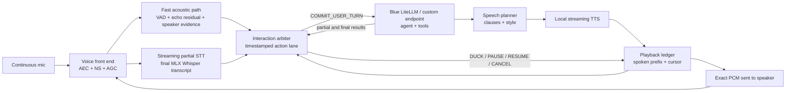

# Full-duplex voice: recent literature and a geno-voice architecture

_Research snapshot: 2026-08-26. Primary sources only: papers, official project
pages, official repositories, and platform documentation._

Version-pinned offline copies are available in the
[full-duplex paper archive](papers/full-duplex/README.md).

## Executive conclusion

The recent literature points to a better design than “VAD fired, therefore
cancel the assistant.” A capable full-duplex agent separates two timescales:

1. A **real-time interaction layer** continuously observes cleaned audio and
   playback state, predicts conversational events, and controls listening,
   ducking, yielding, resuming, and backchannels.
2. A **thinking/action layer** performs slower reasoning and tool use
   asynchronously.

That is the central idea in 2026's
[DuplexOmni](https://arxiv.org/abs/2606.09186), and it is also compatible with
[FlexDuo](https://arxiv.org/abs/2502.13472)'s pluggable controller. It fits
geno-voice better than replacing the current stack with Moshi or another native
speech model, because the configured Blue LiteLLM or custom endpoint can remain
the thinking and tool-using brain.

Two additional findings sharpen that split.
[FireRedChat](https://arxiv.org/abs/2509.06502) shows a deployable modular
controller built from personalized VAD, semantic end-of-turn detection, and a
separate dialogue manager, while
[Endpoint Anticipation](https://arxiv.org/abs/2606.13450) shows that a cascaded
agent can speculatively prepare LLM and TTS output before the user finishes
without playing it until the endpoint is confirmed. In other words, we do not
need to replace Blue to get much of the latency benefit of a native duplex
model.

The recommended target is therefore:

```text
continuous microphone + exact playback reference
  -> AEC / noise suppression / target-speaker evidence
  -> fast acoustic detector
  -> streaming acoustic + semantic interaction arbiter
  -> pause / listen / ignore / backchannel / interrupt / take-turn actions
  -> asynchronous Blue agent
  -> chunked local TTS with an exact "audio actually heard" ledger
```

VAD remains useful, but only as evidence. It must not retain sole authority to
cancel an agent turn.

## Why the present controller fails

The current human test used an energy gate with `silence_threshold=0.003`,
`silence_duration=0.8`, and `min_speech_duration=0.3`. With the MacBook mic and
Dell monitor output, speaker leakage caused four interruptions in four turns,
two silent turns, and about 0.9 seconds of stale microphone audio. macOS `say`
was also transcribed as the user. The trace is documented in
[the human voice turn explainer](../human-voice-turn-explainer.md#why-full-duplex-interrupted-itself).

The current effective rule is:

```text
RMS threshold crossed -> assume user interruption -> cancel LLM/TTS
```

That rule confuses at least five acoustically similar events:

- assistant playback leaking into the mic;
- target-user backchannel ("mm-hmm");
- target-user substantive interruption ("wait, use the other file");
- speech addressed to someone else;
- background speech or noise.

[Full-Duplex-Bench v1.5](https://arxiv.org/abs/2507.23159) formalizes almost
exactly these cases. It expects `RESPOND` to a real interruption and `RESUME` to
a backchannel, other-addressed speech, or background speech. It separately
measures stop latency and response latency. A single RMS threshold cannot solve
that task.

## What the recent literature contributes

### 1. Native continuous speech models establish the ceiling

Native duplex models place both speakers on one clock. They learn silence,
overlap, backchannels, interruption, and speech generation jointly instead of
handing turns between ASR, an LLM, and TTS.

| Work | Core mechanism | Release and compute | What geno-voice should take from it |
|---|---|---|---|
| [dGSLM](https://arxiv.org/abs/2203.16502) (2022/2023) | Foundational dual-channel generative spoken-dialogue modeling over discrete speech units. | [Official fairseq implementation](https://github.com/facebookresearch/fairseq/tree/main/examples/textless_nlp/dgslm). | Treat two simultaneous speaker timelines as the correct abstraction, even if our implementation remains modular. |
| [SyncLLM](https://arxiv.org/abs/2409.15594) (EMNLP 2024) | Interleaves fixed-duration HuBERT chunks for the two speakers and explicitly synchronizes an 8B Llama 3 model to wall-clock time. It estimates the unavailable current user chunk before generating its next chunk, and tests up to 240 ms simulated network latency. | The [official project page](https://syncllm.cs.washington.edu/) publishes the paper and samples, but no code or weights. Training used 212k hours of synthetic and 2k hours of real dialogue. | Every controller decision and emitted audio span should carry a timestamp; network delay is part of the state, not an afterthought. |
| [Moshi](https://arxiv.org/abs/2410.00037) (2024) | A 7B temporal transformer jointly models user audio, assistant audio, and assistant inner-monologue text through the Mimi codec. Reported latency is 160 ms theoretical and about 200 ms on an L4. | [Code](https://github.com/kyutai-labs/moshi) is Apache-2.0; weights are CC BY 4.0. PyTorch, Rust, and MLX implementations are released, including 4-bit Mac weights. The project reports testing MLX on an M3 Mac. | Use Moshi as a behavioral and latency baseline on the Mac. It is not a drop-in voice I/O layer for Blue: its dialogue policy and language model are coupled to its speech streams. |
| [SALM-Duplex](https://arxiv.org/abs/2505.15670) (2025) | Fuses a continuous 80 ms user-speech encoder with assistant text and codec-audio channels. The paper demonstrates that duplex behavior can be added without speech-text pretraining. | [Training and inference code](https://github.com/NVIDIA-NeMo/NeMo/tree/main/examples/speechlm2) is now present in upstream NeMo (the paper's original fork link has disappeared). The reported model uses TinyLlama 1.1B plus a 100M streaming encoder; training used 32 A100 80 GB GPUs and thousands of hours of mostly synthetic duplex data. | Separate user perception from assistant voice generation. Its 0.64 s learned yield delay is also a useful conservative baseline, although too slow for our final target. |
| [DuplexSLA](https://arxiv.org/abs/2605.20755) (2026) | Adds a third, rate-limited textual **action channel** beside continuous user audio and assistant audio. Turn labels, plans, transcripts, and structured tool calls share a 160 ms clock without halting speech. | The [MIT repository](https://github.com/hyzhang24/DuplexSLA) currently contains the report and demo assets; inference code, a 7B checkpoint, and DuplexSLA-Bench are still marked “coming soon.” | Give interaction decisions and tool/action events their own timestamped lane. Do not overload either the user transcript or spoken assistant text with control state. |
| [DuplexOmni](https://arxiv.org/abs/2606.09186) (2026) | Separates a low-latency **interaction layer** from a pluggable asynchronous **thinking layer**. The interaction model consumes 480 ms slices, can stop obsolete thinking streams, and progressively incorporates returned results into speech. | Paper only; it reports initialization from Qwen3-Omni, training on 128 H20 GPUs, 0.506 s response latency, and no linked weights or inference code. | This is the closest architectural match: geno-voice becomes the interaction layer; the configured Blue/custom endpoint remains the thinking and tool layer. |
| [F-Actor](https://arxiv.org/abs/2601.11329) (2026) | An instruction-following full-duplex model that controls voice, topic, dialogue initiation, backchannels, and interruptions while keeping its audio encoder frozen. | The [official repository](https://github.com/MaikeZuefle/f-actor) releases the model and training code. The paper reports a single-stage recipe using 2,000 hours rather than foundation-model-scale speech pretraining. | Treat conversational policy as explicit, configurable input. Backchannel and interruption behavior should be session policy, not hard-coded thresholds. |
| [JoyAI-Talker](https://arxiv.org/abs/2608.01119) (2026) | A decoupled Thinker-Talker plus a state-driven, plug-in Joy-Duplex gate. Its Talker accepts natural-language controls for emotion, speaking rate, vocal effort, laughter, and sighs. | Paper only at this snapshot. The language backbone is a 48.9B sparse MoE with about 3.28B active parameters. | Keep interaction control, semantic response planning, and expressive rendering as separate interfaces. Kokoro can be upgraded independently of the duplex controller. |

Native models are valuable benchmarks and research references. They are not the
first implementation choice for geno-voice because they replace or tightly
couple the agent brain, require substantial training, and cannot preserve the
configured Blue endpoint as a clean dependency.

### 2. Pluggable controllers are the practical bridge

[FlexDuo](https://arxiv.org/abs/2502.13472) is directly relevant because it
wraps a half-duplex dialogue system with a context manager, a state manager,
and an audio sliding window. Every 120 ms its Qwen2-Audio-7B controller chooses
one of seven actions:

```text
KEEP_SPEAKING     KEEP_LISTENING     KEEP_IDLING
SPEAK_TO_LISTEN   SPEAK_TO_IDLE      LISTEN_TO_SPEAK
IDLE_TO_LISTEN
```

The explicit `IDLE` state filters backchannels, third-party speech, and noise
instead of polluting dialogue context. This is an important improvement over a
binary speaking/listening FSM. FlexDuo reports training on 671 hours of English
Fisher and 263 hours of Chinese Fisher data, but does not release controller
code or weights and its 7B controller is unnecessarily large for our first
version.

[LLM-Enhanced Dialogue Management for Full-Duplex Spoken Dialogue
Systems](https://arxiv.org/abs/2502.14145) demonstrates a smaller form of the
same idea. A 0.5B semantic dialogue manager predicts four control tokens:

```text
CONTINUE_LISTENING   START_SPEAKING
START_LISTENING      CONTINUE_SPEAKING
```

The paper's pipeline explicitly places AEC, acoustic VAD, ASR, and the semantic
manager before the larger core dialogue engine. The semantic manager
distinguishes a real interruption from acknowledgements, speech addressed to
someone else, and unrelated comments. The authors release their
[dialogue-data generation scripts](https://github.com/HaoZhang6720/fullduplex-dialogue-data),
but not a ready-to-run model.

These papers support a controller that is:

- independent of the Blue model and local TTS engine;
- small enough to run continuously or on acoustic triggers;
- multi-state rather than binary;
- trained and evaluated on overlaps, not only clean endpoint clips.

[FireRedChat](https://arxiv.org/abs/2509.06502) is the closest released
engineering reference for this path. Its controller combines streaming
personalized VAD (pVAD), which rejects noise and non-primary speakers, with a
semantic end-of-turn model; the interaction module and tool-capable dialogue
manager remain replaceable. The
[Apache-2.0 repository](https://github.com/FireRedTeam/FireRedChat) includes
pVAD and turn-detector models and a self-hosted cascaded system. We should
benchmark those two components against geno-voice's existing detector seams
before training our own arbiter.

### 3. Turn projection needs both acoustic and semantic evidence

The useful component literature divides into complementary signals:

- [Voice Activity Projection (VAP)](https://arxiv.org/abs/2205.09812)
  predicts the joint future voice activity of both speakers rather than only
  classifying current speech. Its zero-shot uses include SHIFT/HOLD,
  turn-shift projection, and backchannel projection. The
  [MIT-licensed implementation](https://github.com/ErikEkstedt/VoiceActivityProjection)
  consumes separated stereo speaker channels, and a
  [2024 real-time study](https://arxiv.org/abs/2401.04868) demonstrates CPU
  operation. A later paper fine-tunes VAP for continuous backchannel timing and
  type prediction: [“Yeah, Un, Oh”](https://arxiv.org/abs/2410.15929).
- [Applying General Turn-taking Models to Conversational
  HRI](https://arxiv.org/abs/2501.08946) combines acoustic VAP with textual
  TurnGPT. Its lesson is architectural: acoustic/prosodic projection and
  syntactic/pragmatic completion cover different failure modes and should be
  fused rather than forced into one heuristic.
- [Smart Turn v3.2](https://github.com/pipecat-ai/smart-turn) is the most
  immediately adoptable endpoint model. It is audio-native, BSD-2-Clause,
  approximately 8M parameters, 8 MB quantized or 32 MB FP32, and reports
  10–100 ms CPU inference. It runs after a lightweight VAD finds silence and
  classifies whether the accumulated utterance is complete. It does **not** by
  itself classify an overlap during assistant playback as backchannel,
  interruption, echo, or other-addressed speech.
- [SpeculativeETD](https://arxiv.org/abs/2503.23439) uses a tiny streaming GRU
  to distinguish speech from non-speech on each 100 ms chunk, then invokes a
  94M Wav2Vec2 model only after 200 ms of silence to decide pause versus gap.
  This hierarchical pattern reduces expensive inference by more than 10x in
  the paper. Its OpenETD dataset contains more than 120k samples and over 300
  hours, although the paper does not provide a clear artifact license.
- [FastTurn](https://arxiv.org/abs/2604.01897) combines streaming CTC partial
  text, Conformer acoustic representations, a Qwen3-0.6B semantic model, and a
  fused turn head. Its released
  [test set](https://github.com/ASLP-lab/FastTurn) covers `COMPLETE`,
  `INCOMPLETE`, `BACKCHANNEL`, and `WAIT`, including real overlap, echo,
  paralinguistic cues, and noise. The paper reports about 700M total parameters
  and 120 ms average inference on its test setup. The repository releases the
  test set, not runnable model weights, and declares no software license.
- [Next-Turn](https://arxiv.org/abs/2606.18094) predicts time to the next speech
  onset instead of only a binary endpoint. Its targets come directly from
  timestamps, and the paper reports a 25.9-point absolute improvement in
  endpoint accuracy within 320 ms over its strongest baseline. This suggests a
  better future training target for our Superwhisper clips than hand-labeling
  only `done` versus `not done`.
- [Endpoint Anticipation](https://arxiv.org/abs/2606.13450) forecasts endpoints
  as far as 2.56 seconds ahead. Its cascaded integration forks from the partial
  transcript, generates a short LLM look-ahead, pre-synthesizes audio into a
  private cache, then releases or discards that cache after endpoint
  verification. The paper reports 505 ms average latency reduction for 28.4%
  extra speculative computation. For geno-voice, speculation must remain
  inaudible and side-effect-free: no mutating tool call before the turn commits.

The practical synthesis is a cascade of confidence, not a cascade of turns:

```text
20 ms:  echo residual + speech probability + target-speaker probability
80–160 ms: partial transcript + acoustic/prosodic embedding
event boundary: Smart Turn / semantic completeness verification
```

The fast path may duck playback immediately, but only the fused semantic path
may irreversibly cancel a spoken/agent turn.

### 4. Target-speaker evidence must gate the semantic path

The AEC reference answers “is this our own playback?” but not “is this the
enrolled user?” Two recent systems make target identity a first-class streaming
signal:

- FireRedChat uses personalized VAD to reject noise and non-primary speakers
  before barge-in control.
- [IRAF](https://arxiv.org/abs/2606.06559) combines a target-speaker embedding
  with each streaming audio embedding to produce a causal, frame-level
  reliability gate. Interference-dominated frames contribute less to its
  language model rather than being accepted unconditionally.

geno-voice should expose `target_speaker_probability` independently from
ordinary speech probability. Initially it can be a pluggable enrollment-based
speaker-verification score. Later, a small causal fusion head can learn from
the same timestamped feature stream as the interaction arbiter. AEC, pVAD, and
semantic turn classification solve different problems and should not be folded
into one opaque confidence value.

### 5. Echo cancellation is part of the model boundary

AEC is not an optional cleanup pass. Without it, the interaction model is asked
to infer intent from audio known to contain its own output.

- Apple documents AVAudioEngine voice-processing mode specifically for echo
  cancellation and VoIP. It processes input and removes audio produced by the
  device; both input and output nodes must participate. See Apple's
  [WWDC19 AVAudioEngine session](https://developer.apple.com/videos/play/wwdc2019/510/)
  and [voice-processing documentation](https://developer.apple.com/documentation/AVFAudio/using-voice-processing).
- The official WebRTC
  [`AudioProcessing` interface](https://webrtc.googlesource.com/src/+/refs/heads/main/api/audio/audio_processing.h)
  exposes echo cancellation, high-pass filtering, noise suppression, and two
  gain controllers in one real-time front end.
- In an official OpenAI developer case study, Perplexity reports standardizing
  client audio through WebRTC APM—AEC, AGC, noise reduction, and high-pass
  filtering—before transport. It also reports tuning against real microphone,
  speaker-volume, and noisy-environment conditions rather than clean clips:
  [How Perplexity Brought Voice Search to Millions Using the Realtime
  API](https://developers.openai.com/blog/realtime-perplexity-computer).

For the macOS product, `AVAudioEngine.setVoiceProcessingEnabled` is the first
backend to spike because it gives the OS the exact render reference. WebRTC APM
is the cross-platform and headless/server candidate. Headphones remain a useful
control condition, not the product solution.

## Proposed geno-voice design



### Interaction action lane

The arbiter should emit a typed, timestamped event rather than mutating the
pipeline directly:

```python
InteractionDecision(
    action=Action.DUCK | Action.RESUME | Action.IGNORE |
           Action.BACKCHANNEL | Action.COMMIT_USER_TURN |
           Action.INTERRUPT_AGENT,
    confidence=0.0,
    at_audio_frame=0,
    evidence={
        "speech_probability": 0.0,
        "echo_residual": 0.0,
        "target_speaker_probability": 0.0,
        "turn_complete_probability": 0.0,
        "backchannel_probability": 0.0,
        "partial_text": "",
    },
)
```

The existing `session/backchannel.py`, `session/barge_decision.py`,
`session/text_eou.py`, `session/turn_decider.py`, and
`session/full_duplex.py` become feature providers and policy inputs. The new
arbiter owns the final decision. `BargeInCoordinator` should consume confirmed
arbiter actions instead of raw energy events.

### Playback-aware interruption protocol

There are two levels of interruption:

1. **Reversible:** On likely target speech, duck or pause the current TTS
   chunk. Keep the Blue request and remaining PCM resumable while evidence
   accumulates.
2. **Committed:** After the arbiter classifies a substantive interruption,
   cancel future playback, flush captured echo, and commit the new user turn.

If the event is echo, noise, other-addressed speech, or a continuer, resume at
the playback cursor. This prevents a 100–250 ms classifier delay from making
the assistant audibly talk over a real user while avoiding destructive
cancellation on every sound.

The playback ledger must record the exact text/audio span actually rendered.
On interruption, only the heard assistant prefix belongs in conversational
history. Generated-but-unheard suffixes must not be presented to Blue as if the
user heard them. Tool side effects need a separate committed-action log because
they cannot be undone merely by cancelling TTS. This is the modular equivalent
of DuplexSLA's action channel.

### Blue endpoint contract

Blue remains the only reasoning and coding-agent brain. The interaction layer
may use small local models, but it should never silently replace the configured
agent model. Its API to the brain is narrow:

```text
submit_committed_user_turn(transcript, timing, interruption_context)
cancel_or_supersede_response(response_id, heard_assistant_prefix)
receive_agent_text_delta(response_id, text)
receive_tool_event(response_id, event)
```

Do not run speculative tool calls from an incomplete utterance. Response
prefetch can eventually be tested for text-only drafts, but tool execution
should begin only after `COMMIT_USER_TURN`.

## Ranked implementation plan

### 1. Ship the audio front end first

- Spike macOS AVAudioEngine voice processing with a shared input/output graph.
- Feed every assistant sample through the same render node used as the AEC
  reference.
- Preserve the existing PyAudio path behind a backend option.
- Add diagnostics for pre/post-AEC RMS, echo attenuation, double-talk, device,
  route changes, and underruns.

**Exit criterion:** zero self-barge events across repeated open-speaker tests,
including replay of the exact Kokoro and macOS `say` failure audio. Validate
separately with the Zone headset and MacBook/Dell route.

### 2. Replace destructive energy barge-in with reversible ducking

- Raw acoustic onset immediately ducks playback.
- Buffer 200–400 ms while collecting target-speaker, echo, partial-text, and
  duration evidence.
- Backchannel/noise/echo resumes playback; substantive speech commits the
  interruption.
- Drain stale microphone frames at every transition.

**Exit criterion:** true user interruptions feel immediate, while speaker echo
and one-word continuers do not abandon the turn.

### 3. Integrate Smart Turn v3.2 for endpointing

- Add an adapter behind the existing `turn_decider` seam.
- Run it only after the acoustic detector identifies a pause, as its model card
  recommends.
- Fuse its probability with `text_eou` rather than replacing the text signal.
- Keep the current silence heuristic as fallback and record both predictions.

**Exit criterion:** lower false endpoint rate on hesitation/resumption clips
without materially increasing post-completion latency. This is local CPU work
and does not change the Blue endpoint.

### 4. Add a five-class streaming interaction arbiter

Start with rules plus calibrated probabilities, then train a small model on the
logged feature/event stream:

```text
HOLD_USER       TAKE_TURN       CONTINUE_AGENT
YIELD_AGENT     IGNORE_INPUT
```

`CONTINUE_AGENT` includes a recognized backchannel; `IGNORE_INPUT` covers echo,
non-target/background speech, and speech to another person. Use a separate
`backchannel_kind` field instead of adding accidental state explosion.

Use FastTurn as the design reference: streaming CTC/partial text plus acoustic
features, fused at roughly a 160 ms cadence. We should not reproduce its 700M
model initially. A compact audio encoder plus the already-available partial
Whisper text is sufficient to test the state representation.

### 5. Add the playback/context ledger and asynchronous agent bridge

- Associate response IDs, text spans, PCM chunks, playback timestamps, tool
  events, and cancellation state.
- Reconcile the heard prefix on every interruption.
- Let the interaction loop remain responsive while Blue reasons or tools run.
- Cancel/supersede obsolete thinking requests when the user changes the task,
  following DuplexOmni's interaction/thinking split.

Once the committed path is correct, add Endpoint Anticipation as an optional
latency layer. A predicted endpoint may fork a Blue request and pre-synthesize
a short response into fake output, but it must not make sound, mutate files, or
execute tools. Confirmation promotes the fork; resumed user speech discards
it. This is a performance optimization, never the authority for turn state.

### 6. Improve expressivity independently

Add a small speech-plan object between Blue text and Kokoro:

```text
clause text + intent + rate + pause_after + emphasis + affect
```

Initially derive it from punctuation and a local style policy. Later evaluate a
text-controllable expressive TTS backend. JoyAI-Talker supports the separation:
semantic planning chooses how something should sound, while the Talker renders
it. Duplex correctness should not depend on a particular voice model.

### 7. Benchmark native models as a parallel research track

- Run Moshi MLX 4-bit locally as the obtainable full-duplex ceiling.
- If z2 has the necessary NVIDIA memory, run SALM-Duplex or Freeze-Omni there
  for controlled comparisons.
- Do not import either into OpenCode until it beats the modular system on our
  tests and demonstrates a clean way to preserve Blue as the brain.

## Test and evaluation program

The existing `VirtualMicStream`, `VirtualSpeakerStream`, Superwhisper corpus,
and fake-output mode already provide most of the harness. Extend it from a
single input WAV into two time-aligned channels: near-end user audio and
far-end assistant playback. The harness should apply configurable room delay,
gain, filtering, packet jitter, and overlap.

| Test | Expected behavior | Primary metric |
|---|---|---|
| Clean completed question | Take turn promptly | endpoint latency; false hold |
| Mid-thought pause / trailing conjunction | Keep listening | false endpoint rate |
| User interrupts assistant with new intent | Duck, yield, respond | p50/p95 stop latency; respond rate |
| User says “mm-hmm” during assistant speech | Brief duck at most, then resume | false-abandon rate; resume gap |
| User speaks to another person | Ignore and resume | false-respond rate |
| Background speech/noise | Ignore and resume | false-trigger rate by SNR |
| Assistant playback leaked to mic | AEC removes it; never self-barge | self-barge rate; residual echo level |
| Real user + playback (double-talk) | Preserve user and yield correctly | interrupt recall by echo-to-user ratio |
| User changes request while Blue/tool work runs | Supersede safely | stale-response/tool-action rate |
| Interrupted assistant response | History contains only heard prefix | context-ledger accuracy |

Adopt the scenario taxonomy and `RESPOND`/`RESUME` behavior labels from
[Full-Duplex-Bench v1.5](https://github.com/DanielLin94144/Full-Duplex-Bench).
Use its later [v2 real-time examiner](https://arxiv.org/abs/2510.07838) for
multi-turn tests and
[v3](https://arxiv.org/abs/2604.04847) for real human disfluency plus chained
tool use. Add the real, dual-channel conversations from
[HumDial-FDBench](https://arxiv.org/abs/2604.21406) as a second benchmark rather
than relying entirely on synthetic overlaps. Also report:

- true-interruption stop latency and post-interruption response latency;
- backchannel and background false-stop rates;
- false endpoint and delayed endpoint rates;
- target-speaker and other-speaker confusion;
- AEC residual/attenuation and double-talk failures;
- stale mic frames after every transition;
- agent time-to-first-text, TTS time-to-first-audio, and audible response time;
- exact assistant-prefix/context reconciliation accuracy.

Do not collapse these into one “full-duplex score.” A system can be extremely
responsive by cancelling on everything and still be unusable—the v1.5 results
show that failure mode clearly.

## Availability and adoption summary

| Component | Usable now? | License / artifact caution | Recommended role |
|---|---:|---|---|
| Apple AVAudioEngine voice processing | Yes, macOS native | Platform API; requires a real input/output device graph and cannot be toggled while the engine runs | First AEC spike |
| WebRTC AudioProcessing | Yes | WebRTC BSD-style source; integration/build work required | Cross-platform AEC/NS/AGC backend |
| Smart Turn v3.2 | Yes | BSD-2-Clause; code, weights, data, CPU and GPU forms released | First learned EOU signal |
| FireRedChat pVAD + turn detector | Yes | Apache-2.0 repository with released models; full self-hosted stack is substantially heavier than the two target components | First target-speaker and EOU bake-off |
| VAP | Yes, research integration | MIT code; pretrained CPC dependency has its own license; best fit expects separated speaker channels | Turn projection/backchannel experiment after AEC |
| Moshi MLX | Yes | Apache-2.0 code; CC BY 4.0 weights | Local native-duplex benchmark |
| F-Actor | Yes, research benchmark | Model and training code released; verify model/data licenses before redistribution | Promptable backchannel/interruption policy benchmark |
| Freeze-Omni | Yes, NVIDIA-oriented | Code and weights released, but the official repository declares no machine-readable license; Qwen2-7B dependency | z2 benchmark only after license review |
| SALM-Duplex | Partly | NeMo training/inference code is published; validate checkpoint availability and inherited licenses | Reproducible architecture reference / z2 experiment |
| FlexDuo | No ready dependency | Paper, no linked code/weights; Qwen2-Audio-7B controller | State/action design reference |
| FastTurn | Test set only | Test-set repository has no declared software license; no runnable model weights in the official repo | Dataset and fusion design reference |
| DuplexSLA | Not yet | MIT repo, but inference, weights, and benchmark are marked coming soon | Action-channel design reference |
| DuplexOmni | Not yet | Paper only; 128-H20 training scale | Primary interaction/thinking architecture reference |
| JoyAI-Talker | Not yet | Paper only in this snapshot; very large MoE | Expressive Talker and plug-in gate reference |
| HumDial-FDBench | Yes | Real dual-channel conversations and public challenge resources; confirm dataset terms before vendoring | Human-overlap evaluation corpus |

## Decision

Build the sophisticated modular controller, not a local replica of an entire
native duplex foundation model. The first vertical slice should be:

```text
AVAudioEngine AEC
-> reversible playback ducking
-> Smart Turn + partial-text fusion
-> multi-class interaction decision
-> existing Blue agent
-> existing Kokoro playback ledger
```

That slice attacks the observed failure, is testable with the existing virtual
audio tooling, and creates the same interaction/thinking boundary identified by
the latest literature. It also keeps every major component replaceable: the
turn model, Blue endpoint, and expressive TTS can evolve independently.
